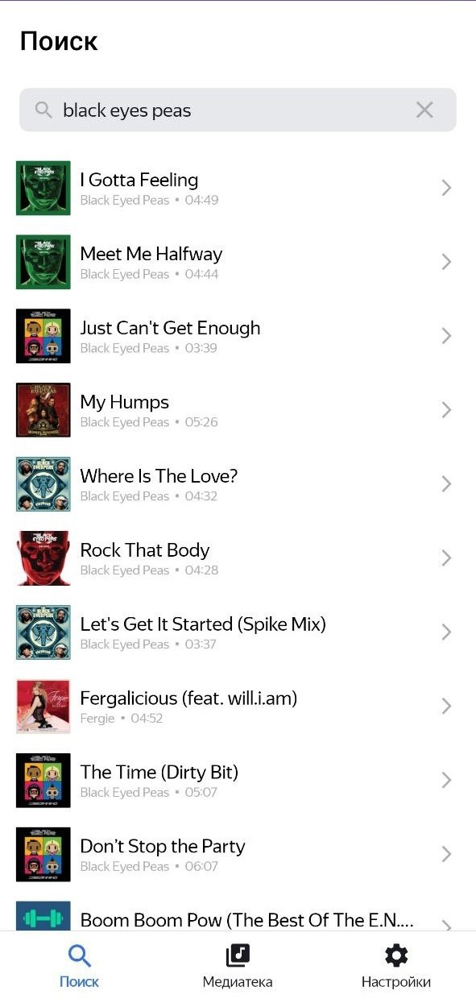
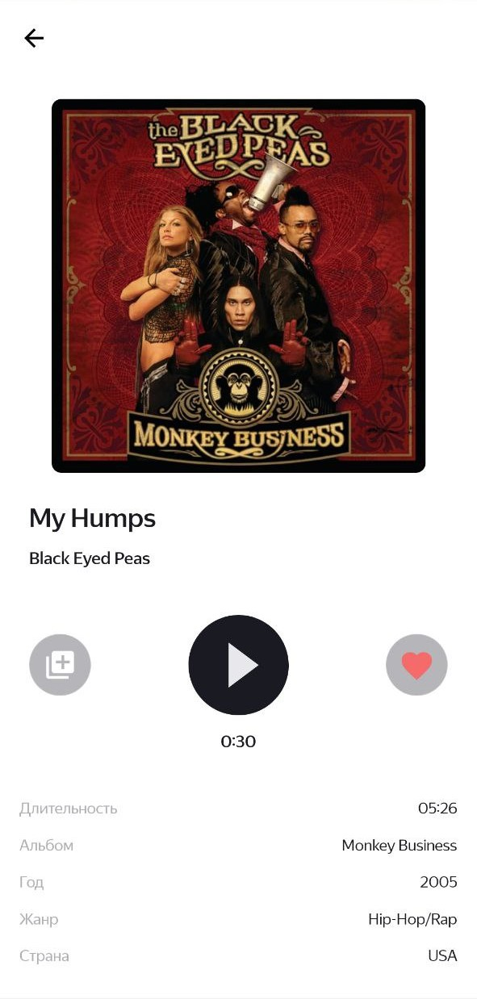

# Playlist Maker

## О приложении
**Playlist Maker** — учебное Android-приложение, которое позволяет искать 
треки через публичный iTunes API, сохранять понравившиеся треки в «Избранное»,
создавать и редактировать плейлисты, прослушивать 30-секундные превью, 
а также делиться плейлистами.

## Ключевые фичи
- Поиск треков через iTunes API с обработкой ошибок (нет интернета / пустой результат и т.д.).
- История поиска (последние 10 открытых треков).
- Экран плеера: информация о треке, проигрывание 30-секундного фрагмента, добавление в «Избранное» и в плейлист.
- «Избранное» хранится офлайн в базе Room.
- Плейлисты: создание, редактирование, удаление, добавление треков, проверка дубликатов.
- Нижняя панель навигации (Поиск / Медиатека / Настройки).
- Тёмная/светлая тема, переключаемая в настройках (SharedPreferences).
- Отправка плейлиста (share intent), отправка письма в поддержку (intent).

## Технологии и библиотеки
- Язык: **Kotlin**
- Архитектура: **MVVM**, **Clean Architecture**
- Асинхронность: **Coroutines**
- Сеть: **Retrofit2**, **Gson**
- База данных: **Room**
- DI: **Koin**
- Navigation: **Jetpack Navigation Component** (safeArgs)
- UI: **Material**, **ViewPager2**, **TabLayout**, **ConstraintLayout**
- Медиа: стандартный `MediaPlayer`
- Библиотеки: Glide, AndroidX, LiveData, ViewModel и др.

(точные версии зависимостей см. в `app/build.gradle` / `gradle/libs.versions.toml`)

## Скриншоты
<p>
  
  &nbsp;
  
</p>
*Экран поиска: ввод запроса и результаты.*  
*Экран плеера: обложка, 30s preview и кнопки добавления.*
<p>
  
  &nbsp;
  
</p>

## Как запустить (локально)
### Требования
- Android Studio 
- Android SDK (minSdk = 29)
- Интернет (для работы iTunes API)

### Шаги
1. Клонировать репозиторий:
   ```bash
   git clone https://github.com/STer231/PlaylistMaker.git
   ```
   
2. Открыть проект в Android Studio: File → Open → выбрать папку PlaylistMaker.

3. Дождаться синхронизации Gradle.

4. Запустить эмулятор или подключить устройство и нажать Run (Shift+F10).

## Улучшения
- Реализовать прогресс-плеер с анимацией и улучшенной работой с жизненным циклом.
- Покрыть ключовую логику unit- и UI-тестами.
- Улучшение стабильности: тестирование и исправление найденных багов.

## Контакты
GitHub: https://github.com/STer231  
Email: 70013593z@gmail.com  
Telegram: https://t.me/SDTeryaev